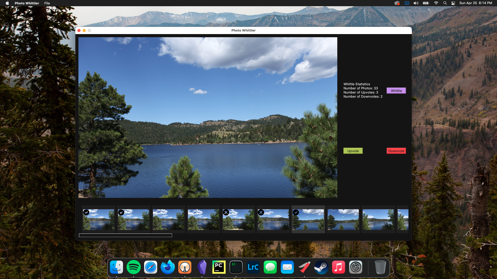

# Photo Whittler

## Program Description
This is meant to be a specific use tool of upvoting and downvoting photos that are meant to be 
then edited in a program like Adobe Lightroom or some other photo editing professional software. 
This is not  meant to replace a photo editing suite, but to augment and provide specially designed 
tools for specific parts of the editing work flow.

## Use-case
This program is meant to specifically augment my current photo work flow where I (personally) may 
take 500 or so photos over the course of a week's vacation. This program is meant to allow the 
user to choose which of the 500 or so raw files that are in the project folder actually need to be 
edited and which can be left on the cutting room floor so to speak.

## Program Installation
1. Download the repo by either:
    1. Cloning the repo with git. This can be done with the command (assuming git is already set up)
       `git clone https://github.com/paradise-runner/photoWhittler.git`
    1. Downloading and unzip the [repo](https://github.com/paradise-runner/photoWhittler)
1. Unzip the Photo Whittler.zip with a double-click
1. Double-click on the photoWhittler app to run!

## .app Creation Instructions (macOS)
Don't trust the .app provided in the .zip? No worries! Compile it yourself with the following 
instructions!
1. Open the terminal
1. Install the [homebrew cli](https://brew.sh/) (if not installed)
1. Install Python 3.9 with the command `brew install python@3.9`. Instructions found
   [here](https://formulae.brew.sh/formula/python@3.9)
1. Change Directories to wherever the repo should be installed. ex. `cd Users/{your_username}/Documents`
1. Download the repo by either:
    1. Cloning the repo with git. This can be done with the command (assuming git is already set up)
       `git clone https://github.com/paradise-runner/photoWhittler.git`
    1. Downloading and unzip the [repo](https://github.com/paradise-runner/photoWhittler)
        1. Copy the unzipped folder to wherever you moved to in step 4
1. Create a virtual environment with the command `python3.9 -m venv venv`
1. Activate the virtual environment with the command `source venv/bin/activate`
1. Install required modules to the virtual environment with the command `pip install -r requirements.txt`
1. Run the shell script `./build-dot-app.sh` to build the app
